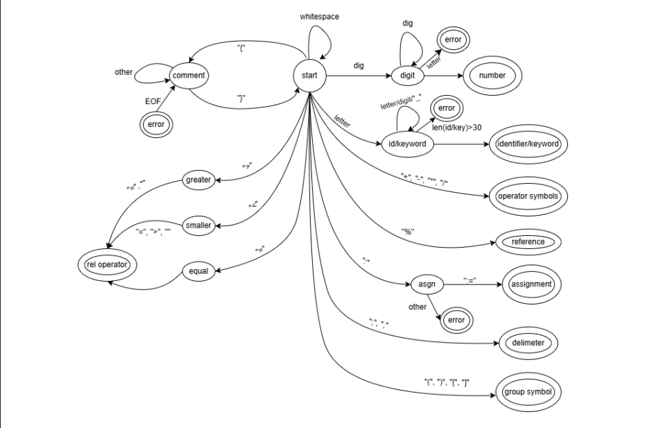

# Greek++ Compiler

A complete, multi-pass compiler for **Greek++**, an educational programming language. This compiler analyzes the source code through multiple phases (lexical, syntax, and semantic analysis) to generate intermediate representations and, ultimately, executable **RISC-V assembly machine code**.

Developed as part of the "Compilers" course at the University of Ioannina, Department of Computer Science & Engineering.

##  Features of Greek++

The language supports a wide range of programming constructs:
* **Data Types & Operations**: Integers, mathematical operators (`+`, `-`, `*`, `/`), and relational operators.
* **Control Flow**: Conditional statements (`εάν` / `αλλιώς`) and loop structures (`όσο`, `επανάλαβε...μέχρι`, `για...έως...με_βήμα`).
* **Subprograms**: Full support for Functions (`συνάρτηση`) and Procedures (`διαδικασία`).
* **Parameter Passing**: By value (CV) and by reference (using the `%` symbol).
* **I/O Operations**: Built-in `διάβασε` (read) and `γράψε` (write) commands.

##  Lexical Analyzer Automaton (DFA)

The first phase of the compilation process uses a **Deterministic Finite Automaton (DFA)** to recognize lexical units (tokens). 

Below is the state transition diagram of the automaton designed for this project:



##  Architecture & Compilation Pipeline

The compiler is highly modular, strictly following the theoretical phases of code translation:

### 1. Lexical Analyzer (`lexer.py`)
The lexical analyzer reads the source code character by character and generates a sequence of `Token` objects. 
* Each `Token` stores information such as its type (e.g., identifier, keyword, number), its value, and the line number where it was found for accurate error reporting.
* It validates characters, skips whitespaces and comments (`{ }`), and enforces the 30-character limit for identifiers.

### 2. Syntax Analyzer (`parser.py`)
Implements a Top-Down **Recursive Descent Parser**.
* Every syntax rule of the Greek++ grammar is mapped to a specific method (e.g., `program()`, `statement()`, `expression()`, `condition()`).
* It utilizes the `match_token` and `next_token` helper functions to ensure the token stream accurately follows the grammar rules, raising descriptive `SyntaxError`s if a violation occurs.

### 3. Intermediate Code Generation (`intermediate.py`)
During syntax analysis, an abstract, low-level representation of the program is produced using **Quads** of the format `[operator, operand 1, operand 2, result]`.
* It implements the `Quad` class, the `genquad` method for creating quads, and `newtemp` for generating temporary variables (e.g., `t@1`).
* To manage control flow (like jumping in `if` and `while` structures), it applies the **backpatching** technique using the `makeList`, `mergeList`, and `backPatch` methods to resolve jump targets dynamically.

### 4. Symbol Table & Semantic Analysis (`symbol_table.py`)
The Symbol Table is responsible for managing variable scopes and storing crucial semantic information.
* **Classes**: Includes `Entity` (for variables, functions, memory offsets), `Scope` (to track the nesting level), and `Argument` (to define parameter passing modes).
* **Semantic Checks**: Using helper functions like `resolveVariable` and `checkFunctionVariables`, the compiler ensures that variables are declared before use, function calls have the correct number and type of arguments, and return values match the function declarations.

### 5. RISC-V Final Code Generation (`codegen.py`)
The final stage translates the intermediate quads into actual RISC-V machine instructions.
* **Memory Management**: Utilizes the stack pointer (`sp`) to build activation records (frames) for scopes and function calls.
* **Variable Access**: The `gnlvCode(n)` function implements **access links** to locate and access non-local variables declared in ancestor scopes.
* **Translation Engine**: The `loadvar` and `storevar` functions handle loading and storing data into registers depending on the variable's scope and passing mode (local, global, by value, or by reference). Finally, `quadToFinalCode` maps the intermediate operations to native RISC-V instructions (e.g., `jal`, `beq`, `lw`, `sw`).

##  Repository Structure

* `main.py` - The entry point that orchestrates the compiler pipeline.
* `state.py` - Manages the global state and data structures (globals, quad lists, scope stack).
* `lexer.py` - The Lexical Analyzer.
* `parser.py` - The Syntax Analyzer (Top-Down Recursive Descent).
* `intermediate.py` - Intermediate Code Generation and backpatching logic.
* `symbol_table.py` - Symbol Table and Semantic Analysis implementation.
* `codegen.py` - RISC-V Assembly generation.
* `docs/` - Documentation directory (contains diagrams like the DFA).

##  Usage

To compile a Greek++ program, run the `main.py` script and pass your source file as an argument:

```bash
python main.py <source_file.gr>
```

###  Output Files
If the source code is valid and compilation is successful, the compiler will generate three output files in the same directory, sharing the base name of your source file (e.g., if you compile `test.gr`, you will get `test.int`, `test.sym`, and `test.asm`):

1. **`.int` file**: Contains the **Intermediate Code** (Quads) generated during the compilation. Useful for debugging the program's logic.
2. **`.sym` file**: Contains a snapshot of the **Symbol Table**, listing all scopes, variables, functions, types, and their memory offsets.
3. **`.asm` file**: The final, executable **RISC-V Assembly** code.

###  Running the `.asm` File
To execute the generated RISC-V assembly code, you need a RISC-V simulator. [RARS (RISC-V Assembler and Runtime Simulator)](https://github.com/TheThirdOne/rars) is highly recommended.

**Option A: Using RARS GUI**
1. Download the `rars.jar` file.
2. Open RARS and load your generated `.asm` file.
3. Click **Assemble** (or press F3), and then click **Run** (or press F5) to execute the program. Any `γράψε` (print) or `διάβασε` (input) instructions will appear in the Run I/O tab at the bottom.

**Option B: Using Command Line**
If you have Java installed, you can execute the assembly file directly from your terminal:
```bash
java -jar rars.jar <source_file.asm>
```

##  Example Code

Here is a simple example of a Greek++ program calculating the double of a number:

```text
πρόγραμμα simple_demo
    δήλωση i, a, b
    
    συνάρτηση diplasio(x)
        διαπροσωπεία
            είσοδος x
    αρχή_συνάρτησης
        diplasio := x * 2
    τέλος_συνάρτησης

αρχή_προγράμματος
    a := 3;
    b := εκτέλεσε diplasio(a);
    γράψε b;
τέλος_προγράμματος
```

##  Authors
* **[Panagiotis Karamperis](https://github.com/karamperiss)**
* **[Georgios Vlatas](https://github.com/VlatasGiorgos)**
